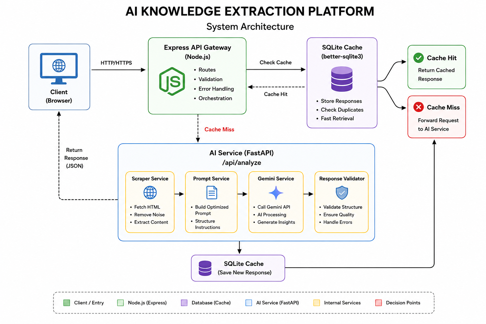
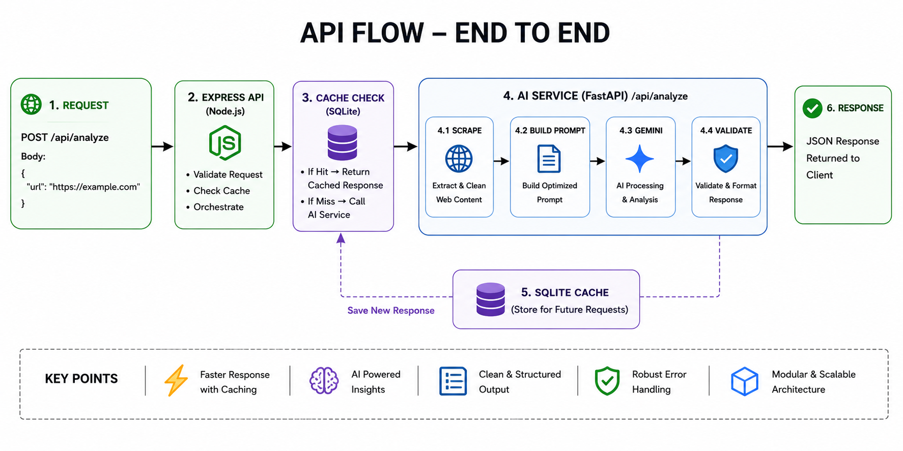
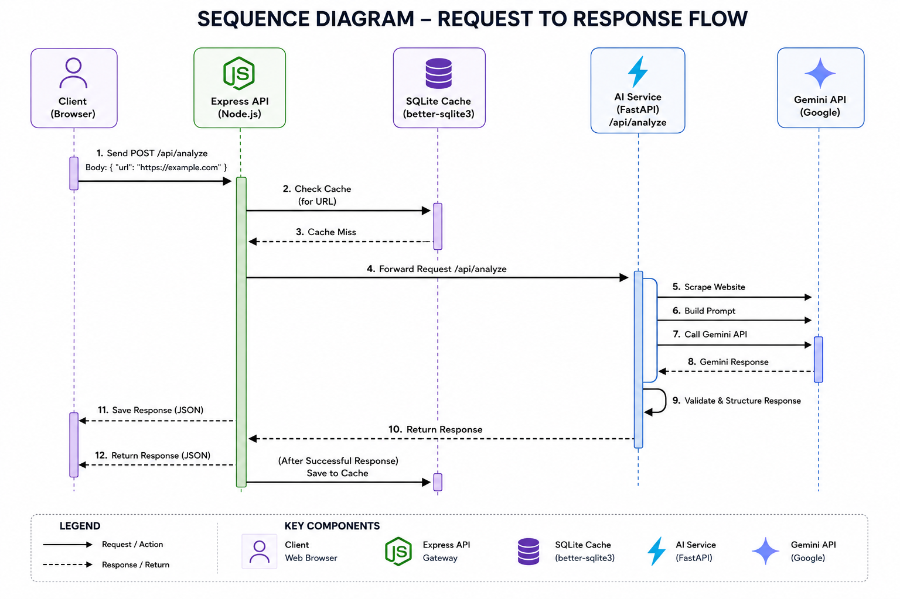

# AI Knowledge Extraction Platform

> **An AI-powered, service-oriented web application that extracts, processes, analyzes, and summarizes web content using a distributed multi-service architecture.**

---

## Project Highlights

- 🏗️ Service-oriented architecture (Express + FastAPI)
- 🤖 AI-powered content extraction using Gemini
- ⚡ SQLite cache-first request pipeline
- 🔄 Scheduled background cache cleanup
- 📦 Modular backend following separation of concerns
- 🛡️ Centralized validation and error handling
- 🚀 Production-inspired API Gateway architecture

---
## Project Overview

AI Knowledge Extraction Platform is a software engineering project designed to demonstrate backend architecture, asynchronous programming, API integration, AI-assisted processing, caching strategies, error handling, and system design principles.

Unlike a traditional web scraper, this application transforms raw webpages into structured easily understandable knowledge using an AI processing pipeline.

The project is intentionally designed using multiple services communicating together, similar to production software systems.

---

# Demo Workflow

```
                    Browser
                       │
                       ▼
                Express API Gateway
                       │
                Validate Request
                       │
                       ▼
                 SQLite Cache
              ┌────────┴────────┐
              │                 │
           Cache Hit        Cache Miss
              │                 │
              │                 ▼
              │          FastAPI Service
              │                 │
              │        Analysis Orchestrator
              │                 │
              │     ┌───────────┼────────────┐
              │     │           │            │
              │  Scraper      Prompt      Gemini
              │     │           │            │
              │     └───────────┼────────────┘
              │                 │
              │          Response Formatter
              │                 │
              │            Save to SQLite
              │                 │
              └──────────◄──────┘
                       │
                       ▼
                    Browser
```

---

# Architecture Diagrams

## System Architecture



---

## API Flow



---

## Sequence Diagram



---

# Folder Structure

```
AI-Knowledge-Extractor/
│
├── frontend/
│   │
│   ├── css/
│   │      style.css
│   │
│   ├── js/
│   │      app.js
│   │      validator.js
│   │
│   ├── images/
│   │
│   └── index.html
│
├── backend/
│   │
│   ├── src/
│   │   │
│   │   ├── routes/
│   │   │      analysis.routes.js
│   │   │
│   │   ├── controllers/
│   │   │      analysis.controller.js
│   │   │
│   │   ├── services/
│   │   │      analysis.service.js
│   │   │      cache.service.js
│   │   │
│   │   ├── middleware/
│   │   │      validator.js
│   │   │      errorHandler.js
│   │   │
│   │   ├── db/
│   │   │      connection.js
│   │   │      schema.js
│   │   │
│   │   ├── jobs/
│   │   │      cacheCleanup.jobs.js
│   │   │
│   │   └── config/
│   │          config.js
│   │
│   ├── storage/
│   │      extractor.db
│   │
│   ├── package-lock.json
│   ├── package.json
│   ├── server.js
│   └── .env
│
├── ai-service/
│   │
│   ├── app/
│   │   │
│   │   ├── main.py
│   │   │
│   │   ├── routers/
│   │   │      analysis.py
│   │   │
│   │   ├── services/
│   │   │      analysis_service.py
│   │   │      scraper_service.py
│   │   │      prompt_service.py
│   │   │      gemini_service.py
│   │   │      format_service.py
│   │   │
│   │   ├── schemas/
│   │   │      request.py
│   │   │      response.py
│   │   │
│   │   └── config.py
│   │
│   ├── requirements.txt
│   └── .env
│
├── docs/
│   ├── example_responses/
│   │      bbc_news.json
│   │      railway_fastAPi.json
│   │
│   └── images/
│          system-architecture.png
│          sequence-diagram.png
│          api-flow.png
│
├── .gitignore
└── README.md
```
---

# Features

## Web Scraping

* Extract webpage content
* Remove advertisements
* Remove scripts
* Remove navigation bars
* Extract headings
* Extract paragraphs


## AI Processing

* AI-generated summary
* Key insights
* Frequently Asked Questions
* Keyword extraction
* Main Topic extraction
* Reading time estimation
* Sentiment analysis


## Backend

* REST API
* Modular architecture
* Input validation
* Centralized error handling
* Async request handling


## Database

Stores

* URL
* Title
* Timestamp
* AI Response


## Performance

* Response caching
* Duplicate request detection
* Efficient HTML cleaning
* Optimized AI prompt

## Cache Architecture

To reduce unnecessary scraping and AI inference, the Express API Gateway implements a cache-first strategy.

```
                    Express API Gateway
                            │
                            ▼
                     Request Controller
                            │
                  Cache Lookup (SQLite)
                    │               │
               Cache Hit       Cache Miss
                    │               │
                    ▼               ▼
              Return JSON     FastAPI Service
                                      │
                               Analysis Pipeline
                                      │
                               Save to Cache
                                      │
                                      ▼
                                 Return JSON
```

Repeated requests never reach the FastAPI service, significantly reducing response time and AI API usage.


## Background Jobs

The backend runs scheduled maintenance jobs to automatically remove expired cache entries.

```
        Background Jobs
               │
               ▼
     startCacheCleanupJob()
               │
        Every 3 Hour
               │
               ▼
     removeExpiredCache()
               │
               ▼
            SQLite
```

This keeps the cache lightweight while preventing stale AI responses from being served indefinitely.


## Reliability

* Invalid URL handling
* Network timeout handling
* Retry mechanism
* AI failure recovery
* Graceful error messages

---

# API

## POST

```
Express: /api/analyze
```

Input

```json
{
    "url":"https://example.com"
}
```

Response

```json
{
    "success": true,
    "data": {
        "title": "Example Website",

        "summary": "...",

        "keywords": [
            "...",
            "...",
            "..."
        ],

        "mainTopics": [
            "...",
            "...",
            "..."
        ],

        "faq": [
            {
                "question": "...",
                "answer": "..."
            }
        ],

        "sentiment": "Positive",

        "readingTime": "5 min",

        "cached": false
    },
    "message": "Express to FastAPI Response",

    "errorCode": null
}
```

---

# Technologies Used

Development Tools

- Git
- GitHub
- VS Code
- Postman

Deployment

- Render

Database

- better-sqlite3

Artificial Intelligence

- Gemini API

Python

- FastAPI
- BeautifulSoup
- Requests

Backend

- Express.js
- Axios

Frontend

- HTML
- CSS
- JavaScript

---

# Engineering Concepts Demonstrated

This project demonstrates practical software engineering concepts including:

- Layered Architecture
- Service-Oriented Design
- API Gateway Pattern
- Separation of Concerns
- Cache-First Request Processing
- Inter-Service HTTP Communication
- AI Pipeline Orchestration
- RESTful API Design
- SQLite-Based Response Caching
- Background Job Scheduling
- Configuration Management
- Input Validation
- Centralized Error Handling
- Retry Mechanism
- Graceful Failure Recovery
- Modular Project Structure

---

# Why this Project?

This project was built to demonstrate production-oriented backend engineering rather than simply integrating an AI API.

Key goals include:

- Designing a modular multi-service architecture.
- Building a cache-first API Gateway.
- Separating business logic across independent services.
- Implementing reliable AI request orchestration.
- Demonstrating software engineering principles suitable for scalable systems.

---

# Future Improvements

### Infrastructure

- Docker support
- Docker Compose
- Nginx Reverse Proxy
- Kubernetes deployment

### Performance

- Redis distributed cache
- Background task queue
- Rate limiting
- Response compression

### AI

- Multi-model support (Gemini, OpenAI, Claude)
- Streaming responses
- Semantic search
- Vector database integration
- Retrieval-Augmented Generation (RAG)

### Backend

- PostgreSQL support
- Authentication & Authorization
- User accounts
- API versioning
- Metrics & Monitoring

### Frontend

- Search history
- Dashboard
- Export to PDF
- Dark mode
- Shareable analysis links

### DevOps

- CI/CD with GitHub Actions
- Unit & Integration Tests
- Automated deployment
- Health check endpoints

---

# Deployment
Project deployed using `Render`
```bash
https://ai-knowledge-extraction-platform.onrender.com

https://ai-knowledge-extraction-api.onrender.com
```

---